# 🚀 Welcome to my Little Corner! 🌟

<div align="center">
  
### 👾 Code "Wizard" | 🤖 Robot Whisperer | 🎨 Artistic with an "u"

</div>

---

## 💫 About This Human

Hey there, fellow explorer! 👋 I'm a **full-snack developer** and **AI enthusiast** who loves turning caffeine into bad code and worse ideas into reality. I'm all about creating cool stuff that kinda works (most of the time... okay, sometimes... I'm debugging it right now).

> *"Any sufficiently advanced technology is indistinguishable from magic"* — Arthur C. Clarke  
> *"Any sufficiently debugged code is indistinguishable from a miracle"* — Me, probably (Could've been me, was Copilot tho)

---

## 🛠️ My Tech Toolbox

### 🌐 **Web Development Arsenal**
```typescript
const skills = {
  frontend: ['TypeScript', 'Vite', 'HTML/CSS'],
  backend: ['Python', 'FastAPI', 'Node.js'],
  tools: ['Docker', 'nginx', 'ESLint', 'Prettier'],
  vibes: ['Clean Code', 'Modern UI', 'Performance']
};
```

### 🤖 **Robotics & Hardware**
```cpp
// Where C++ meets the physical world
namespace Robotics {
  // Platforms: ROS2, PlatformIO, Arduino
  // Languages: C++, Python
  // Latest abandoned Project: ASA Robot! (Got it to drive, then gave up)
}
```

### 🔧 **Other Cool Stuff**
- 🐳 **DevOps**: Docker, CI/CD workflows
- 🎯 **Always Learning**: Because the tech world never sleeps (and neither do I, apparently)

---

## 🎯 Current Quests

- 🔭 **Building**: FSI Dashboard & API — A Dashboard for the [FSI](https://fsi.hochschule-trier.de/) with a slick TypeScript frontend and Python backend
- 🤖 **Tinkering**: ASA Robot projects — Making robots smarter, one line of code at a time
- 🌱 **Learning**: Advanced ROS2 patterns and modern web architecture
- 📖 **Teaching**: Guiding students through the wonderful chaos of web development
- ☕ **Surviving**: On coffee, memes, and the occasional successful `git push`

---

## 🎮 Fun Facts & Random Bits

- 🎲 **Debug Philosophy**: "It's not a bug, it's an unexpected feature" — said every developer ever
- 🌙 **Night Owl**: Best code happens at 2 AM (don't @ me)
- 🎨 **Aesthetic Matters**: If it doesn't look good, did it even compile?

---

## 📊 GitHub Stats That Make Me Look Productive

<div align="center">
  



</div>

---

## 📫 Let's Connect!

<div align="center">

[](https://github.com/DbrStudio)
[](https://github.com/DbrStudio?tab=repositories)

</div>

---

## 💭 Closing Thoughts

Thanks for stopping by! Feel free to explore my repositories, star what you like, and don't hesitate to reach out if you want to collaborate on something awesome! 

---

<div align="center">


</div>
